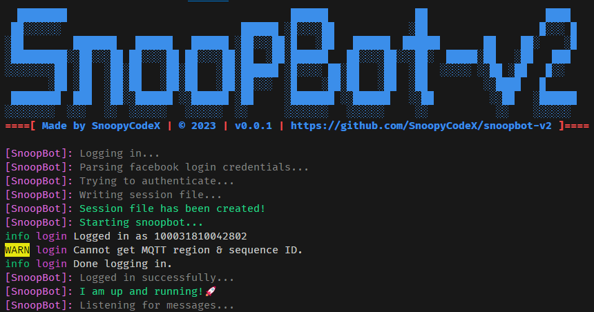

# SnoopBot v2

**SnoopBot v2** is an opensource **facebook messenger chatbot** that is made for educational purposes only. This chatbbot can be customized to your liking.

## Techs Used

- NodeJS
- Typescript
- Puppeteer JS
- Express JS
- Axios



## Available commands of SnoopBot
| Command | Usage | Description |
|:-------:|:-----:|:------------|
| `/play` | `/play <song>` | Searches for the song and sends it to the thread |
| `/qr-code` | `/qr-code <text>` | Encodes a text into a qr code and sends it to the thread |
| `/ris` | `/ris <image-url: optional>` | Perform a reverse image search and sends the result to the thread |
| `/help` | `/help` | Displays help information about the commands |

## Commands that only bot administrators can use
| Command | Usage | Description |
|:-------:|:-----:|:------------|
| `/admin` | `/admin <promote\|demote\|list> <@you \| [@person1, @person2...]>` | Promotes/Demotes user(s) as bot administrators in the thread or list bot administrators in the thread |
| `/join` | `/join` | Adds the current thread to the whitelist. Threads that are not in the whitelist will be ignored by SnoopBot and will not respond to any commands **unless** the sender is a bot administrator or owner |
| `/leave` | `/leave` | Removes the current thread from the whitelist. |
| `/permission` | `/permission <grant\|revoke> <all \| [@command1, @command2...]> <@all \| [@person1, @person2...]>` | Grants or revokes user(s) for permission to all or specific command(s) **except for admin only commands** |
| `/settings` | `/settings <option> <value> \| /settings list` | Update SnoopBot's settings in the current thread. Type `/settings list` to see all of SnoopBot's settings. |

## Automatic features of SnoopBot
| Feature | Status | Description |
|:-------:|:------:|:------------|
| Anti Unsend | `Disabled` by default | Resends the unsent message back to the thread |
| Auto Greet | `Disabled` by default | Automatically sends a greeting or farewell message when a user joins/leaves a thread |

## Cloning SnoopBot

```bash
git clone https://github.com/SnoopyCodeX/snoopbot-v2
```

## Running locally

Download dependencies

```bash
npm install
```

Rename <kbd><samp>.env.development</samp></kbd> to <kbd><samp>.env</samp></kbd> and configure the following:

```bash
# For facebook authentication
# Add your facebook account email and password here
FB_EMAIL=
FB_PASS=

# For downloading profile picture using facebook's api
# One of SnoopBot's feature needs to download a user's profile picture using
# facebook graph api. Go to https://developers.facebook.com to get yours.
FB_ACCESS_TOKEN=

# Set this to false if you're deploying this to replit.com
IS_LOCAL=true

# Your secret key for encrypting/decrypting the `state.session` file
CRYPT_SECRET_KEY='mysupersecretkey'
```

Delete the existing <kbd><samp>state.session</samp></kbd> file so that SnoopBot will create a new one for you
based on your facebook account credentials.

Then run:

```bash
npm run start
```

## Contributing

You may fork this repository and create a pull request. See the [Docs](./DOCS.md) on how to work with this repository.

## Credits

- [Jerson Carin](https://github.com/jersoncarin)
- [itsmenewbie03](https://github.com/itsmenewbie03)
- [Unofficial Facebook API](https://github.com/VangBanLaNhat/fca-unofficial)

## License

```
BSD 3-Clause License

Copyright (c) 2023, SnoopyCodeX

Redistribution and use in source and binary forms, with or without
modification, are permitted provided that the following conditions are met:

1. Redistributions of source code must retain the above copyright notice, this
   list of conditions and the following disclaimer.

2. Redistributions in binary form must reproduce the above copyright notice,
   this list of conditions and the following disclaimer in the documentation
   and/or other materials provided with the distribution.

3. Neither the name of the copyright holder nor the names of its
   contributors may be used to endorse or promote products derived from
   this software without specific prior written permission.

THIS SOFTWARE IS PROVIDED BY THE COPYRIGHT HOLDERS AND CONTRIBUTORS "AS IS"
AND ANY EXPRESS OR IMPLIED WARRANTIES, INCLUDING, BUT NOT LIMITED TO, THE
IMPLIED WARRANTIES OF MERCHANTABILITY AND FITNESS FOR A PARTICULAR PURPOSE ARE
DISCLAIMED. IN NO EVENT SHALL THE COPYRIGHT HOLDER OR CONTRIBUTORS BE LIABLE
FOR ANY DIRECT, INDIRECT, INCIDENTAL, SPECIAL, EXEMPLARY, OR CONSEQUENTIAL
DAMAGES (INCLUDING, BUT NOT LIMITED TO, PROCUREMENT OF SUBSTITUTE GOODS OR
SERVICES; LOSS OF USE, DATA, OR PROFITS; OR BUSINESS INTERRUPTION) HOWEVER
CAUSED AND ON ANY THEORY OF LIABILITY, WHETHER IN CONTRACT, STRICT LIABILITY,
OR TORT (INCLUDING NEGLIGENCE OR OTHERWISE) ARISING IN ANY WAY OUT OF THE USE
OF THIS SOFTWARE, EVEN IF ADVISED OF THE POSSIBILITY OF SUCH DAMAGE.

```